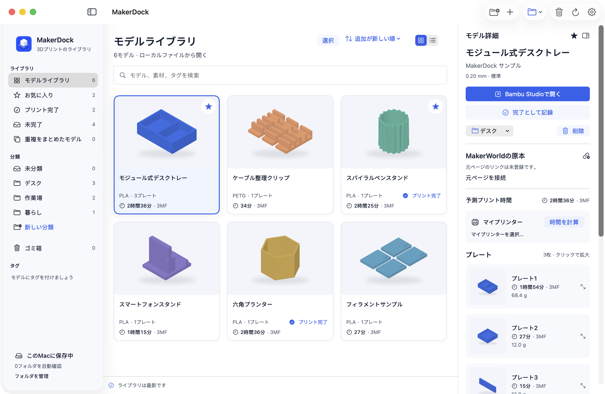
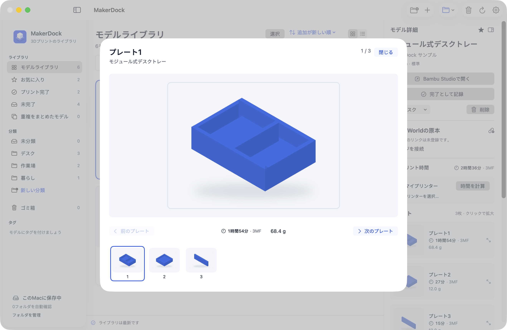
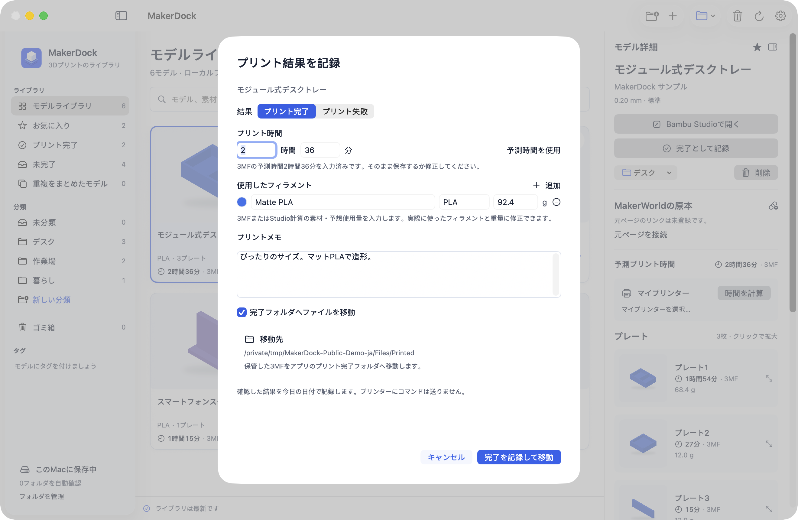
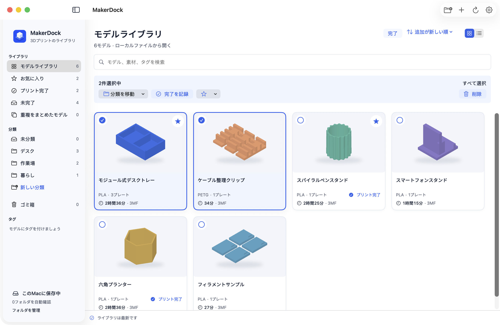

<h1 align="center">MakerDock</h1>

<strong>見つけたモデルも、プリントした記録も。</strong> 3MFコレクションとBambu StudioのためのmacOSコンパニオンアプリ

<a href="README.md">English</a> · <a href="README.ko.md">한국어</a> · <a href="README.zh-CN.md">简体中文</a> · 日本語

<a href="https://github.com/Goodtail/MakerDock/releases">ダウンロード</a> · <a href="#makerdockを作った理由">開発のきっかけ</a> · <a href="#今後の予定">今後の予定</a> · <a href="Docs/development.md">ソースからビルド</a>

macOS 13以降 · Apple Silicon / Intel · 無料・オープンソース · MIT

## MakerDockを作った理由

気に入ったモデルの3MFをダウンロードし、Studioで開く。数日後、もう一度プリントしたくなっても保存場所を思い出せず、またダウンロードしてしまう。ダウンロードフォルダにはファイルが増えていくのに、Finderではプレートの中身も、所要時間も、すでにプリントしたかどうかも分かりません。

**MakerDockは、ダウンロードしたモデルと実際のプリント記録を一緒に整理します。** ファイル名ではなくプレビューで探し、保存済みのファイルを開き直し、結果をモデルのそばに残せます。公式Bambu Studioと併用するアプリなので、改造版スライサーは必要ありません。

## ファイルの山を、使いやすいライブラリに

| こんな困りごとに | MakerDockでできること |
| --- | --- |
| 「あのモデル、どこに保存した？」 | グリッド・リスト表示、検索、カテゴリ、タグ、お気に入りで探せます。 |
| 「これ、前にもダウンロードした？」 | 内容が完全に同じファイルはハッシュで確認して統合し、元の保存場所を記録。異なるプロファイルは別々に残します。 |
| 「各プレートには何がある？」 | 保存されたプレートのプレビューを一覧表示。クリックして拡大できます。 |
| 「プリントにどれくらいかかる？」 | 3MFに保存された見積もりを表示。保存済みのMakerWorld情報があれば優先し、インストール済みのStudioによるプリンター別の計算にも対応します。 |
| 「これ、もうプリントした？」 | 完了・未完了の表示と、プリントごとの時間・フィラメント・メモで確認できます。 |
| 「数十個のファイルを整理したい」 | 複数選択してカテゴリ変更、お気に入り、完了記録、ゴミ箱への移動、復元をまとめて行えます。 |

### すべてのプレートをひと目で

ドロップダウンを一つずつ切り替える必要はありません。プレートのプレビューを並べて確認し、クリックで拡大してからStudioで開けます。

### プリント記録を、手間なく

完了として記録し、入力済みの時間を確認して保存。見積もりは編集でき、情報があればフィラメントの種類・色・使用量も記録できます。次回に役立つメモも残せます。完了した保管ファイルは専用フォルダに移動し、保存前のダイアログで移動内容を確認できます。

### 複数モデルをまとめて整理

選択モードで複数のカードを選び、同じカテゴリへ移動したり、完了として記録したり、復元できるゴミ箱へ移動したりできます。一括完了でも各モデルの時間とフィラメントの初期値は個別に保たれ、共通メモを追加できます。

## ほかにも

- **フォルダの自動確認とドラッグ＆ドロップ:** 3MFを直接読み込むか、選んだフォルダを確認します。
- **保管したオリジナルを保護:** Studioでは作業用コピーを開くため、編集で保管元を上書きしません。
- **元ページのリンクを保存:** MakerWorldのモデル・プリントプロファイルのURLを関連付け、ブラウザで開けます。以前に保存したWeb情報もライブラリに保持します。
- **自分のプリンターで計算:** プリンター、ノズル、品質を選ぶか、公式Studioの選択設定を読み込みます。対応する計算結果はキャッシュします。
- **復元できる整理:** ゴミ箱からカテゴリ・メモ・プリント記録ごと復元できます。ライブラリからの削除で外部の元ファイルは削除しません。
- **4言語のインターフェイス:** 設定から英語・韓国語・日本語・簡体字中国語を選択できます。
- **Macにローカル保存:** ライブラリにMakerDockアカウント、利用状況の収集、クラウドアップロードは不要です。

## はじめに

1. [Releases](https://github.com/Goodtail/MakerDock/releases)からDMGを入手してください。署名・公証の状態はリリースノートに記載します。
2. **MakerDock**を**Applications**フォルダへドラッグします。macOS 13以降、Apple SiliconとIntelに対応しています。
3. `.3mf`を読み込むかウィンドウにドロップし、必要に応じて自動確認するフォルダを選びます。
4. モデルを確認し、別途インストールした**公式Bambu Studio**で開きます。プリントが終わったら完了を記録します。

ライブラリの閲覧と手動記録にStudioは不要です。スライスとStudioを使った時間計算には必要です。

## 見積もりと実際の結果について

未スライスの3MFには形状と設定だけが保存され、所要時間がない場合があります。プリンターを選ぶだけでは正確な時間は出せず、スライスが必要です。MakerDockは対応する公式Studioに、コピーと独立した一時設定を使って計算を依頼できます。印刷前にStudioで最終設定を確認してください。

完了は**ユーザーが手動で記録**します。プリンターの完了を自動検出したり、AMSの在庫をリアルタイムに読み取ったり、実際のフィラメント消費量を測定したりはしません。結果が異なる場合は入力済みの時間や使用量を修正してください。

## 今後の予定

- **Chromeコンパニオン拡張機能 — 公開予定:** モデル・プロファイル情報をライブラリに渡し、保存済みファイルを再利用する仕組みを準備しています。
- **アプリ内のMakerWorld自動取り込み — 実験段階:** 開発ソースにはWeb閲覧、ダウンロード検出、プロファイル再利用の実装があります。サービスの利用許可範囲を確認するまで、公開DMGでは有効にしません。

現在の公開版はローカルファイルの管理が中心です。MakerWorldのダウンロードを横取りしたり、Bambu StudioのURLハンドラーとして登録したりしません。オープンソースのライセンスは外部サービスやモデルの利用権を与えるものではありません。[連携状況](Docs/integration-status.md)をご覧ください。

## 開発とライセンス

SwiftUI、AppKit、小さなSwift製3MFライブラリで構築し、ZIP処理にはZIPFoundationを使っています。本番用と開発用は識別子と保存領域が分かれ、開発版アイコンにはDEVバッジが付きます。

[開発・テスト](Docs/development.md) · [プライバシー](PRIVACY.md) · [貢献について](CONTRIBUTING.md) · [第三者ライセンス](THIRD_PARTY_NOTICES.md)

コード・ドキュメント・独自のサンプルは[MITライセンス](LICENSE)で公開しています。Bambu Studioは別のAGPLアプリであり、同梱していません。MakerDockはGoodtailによる独立したプロジェクトで、Bambu LabやMakerWorldとの提携・公式な推奨はありません。名称と商標は各権利者に帰属します。

すべての画像は、独自のサンプルモデルと説明用の見積もりを使って、実際の日本語版アプリを撮影したものです。個人のライブラリや他の制作者のモデルは含みません。<a href="Docs/screenshots/README.md">撮影と再現の手順</a>
