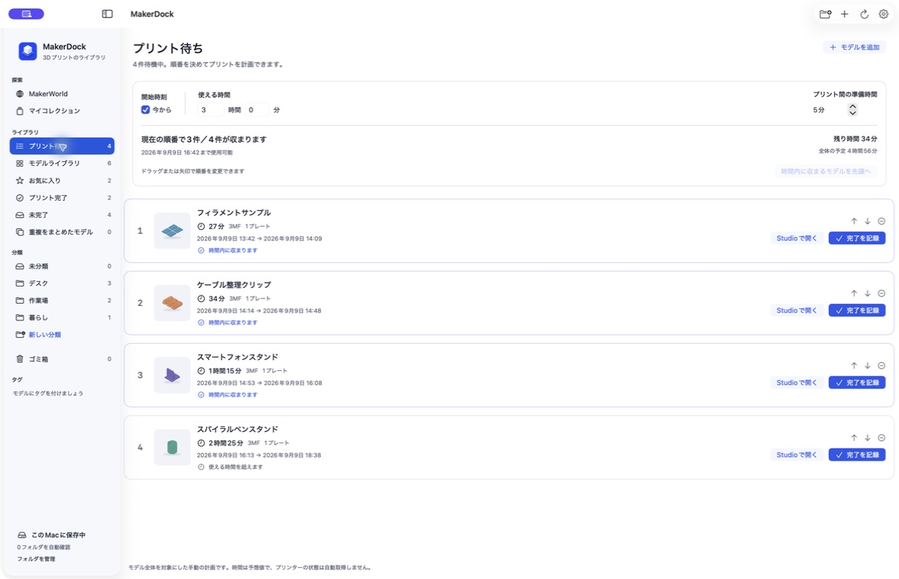

<h1 align="center">MakerDock</h1>

3MFファイルとプリント記録を整理するmacOSアプリ 公式Bambu Studioと一緒に使えます。

<a href="README.md">English</a> · <a href="README.ko.md">한국어</a> · <a href="README.zh-CN.md">简体中文</a> · 日本語

<a href="https://makerdock.goodtail.app/ja">ウェブサイト</a> · <a href="https://github.com/Goodtail/MakerDock/releases">ダウンロード</a> · <a href="#makerdockを作った理由">開発のきっかけ</a> · <a href="#今後の予定">今後の予定</a> · <a href="Docs/development.md">ソースからビルド</a>

macOS 13以降 · Apple Silicon / Intel · 無料・オープンソース · MIT

## MakerDockを作った理由

気に入ったモデルの3MFをダウンロードし、Studioで開く。数日後、もう一度プリントしたくなっても保存場所を思い出せず、またダウンロードしてしまう。ダウンロードフォルダにはファイルが増えていくのに、Finderではプレートの中身も、所要時間も、すでにプリントしたかどうかも分かりません。

MakerDockなら、保存したモデルを検索・カテゴリ・タグ・お気に入りで整理できます。内容が同じファイルはまとめ、異なるプロファイルは別々に保管します。保存済みのモデルを公式Bambu Studioで開き、プリントが終わったら記録を残してください。Studioでは作業用コピーを開くので、保管した元ファイルはそのままです。

### すべてのプレートをひと目で

保存されたプレートのプレビューを一覧で確認し、クリックして拡大できます。カードには3MFの予想時間を表示し、保存済みのMakerWorld情報があれば優先します。モデルやプリントプロファイルの元ページも関連付けられます。

### プリントした記録を残す

完了として記録するときは、入力済みの時間をそのまま保存するか、実際の時間に直します。フィラメントの種類・色・使用量とメモも残せます。保管ファイルの移動先は保存前に確認できます。同じモデルを何度プリントしても、記録はそれぞれ残ります。

### 次のプリントを並べて計画

モデルを**プリント待ち**に追加し、ドラッグして順番を決められます。開始時刻、使える時間、プリント間の準備時間を指定すると、どこまで収まるかを確認できます。時間内に収まるモデルを前に集めることも可能です。保存済みの予想時間を使い、必要なら手入力で調整。キューから完了を記録すると、そのモデルが外れ、履歴は残ります。ライブラリではプリント時間の短い順・長い順にも並べ替えられます。

キューのモデルをプリント中として記録し、開始時刻を残せます。予想時間がなければ設定済みの対応版Studioで計算し、ライブラリにも保存します。任意の[ローカルプリンター接続](Docs/printer-connection.md)で現在のジョブを手動で関連付けると、状態と残り時間を読み取れます。プリント命令は自動送信しません。

### 複数モデルをまとめて整理

グリッド・リスト表示で複数のモデルを選び、カテゴリ変更、お気に入り、完了記録、ゴミ箱への移動をまとめて操作できます。復元するとメモとプリント記録も戻ります。一括完了でも時間とフィラメントの初期値はモデルごとに保たれ、共通メモも追加できます。

ライブラリはMacに保存されます。MakerDockのアカウントは不要で、利用状況の分析データも収集しません。英語・韓国語・日本語・簡体字中国語に対応。表示はシステム設定に合わせるほか、ライト・ダークを選べます。

## はじめに

1. [Releases](https://github.com/Goodtail/MakerDock/releases)からDMGを入手してください。署名・公証の状態はリリースノートに記載します。
2. **MakerDock**を**Applications**フォルダへドラッグします。macOS 13以降、Apple SiliconとIntelに対応しています。
3. `.3mf`を読み込むかウィンドウにドロップし、必要に応じて自動確認するフォルダを選びます。
4. モデルを確認し、別途インストールした**公式Bambu Studio**で開きます。プリントが終わったら完了を記録します。

ライブラリの閲覧と手動記録にStudioは不要です。スライスとStudioを使った時間計算には必要です。

## 見積もりと実際の結果について

未スライスの3MFには予想時間がない場合があります。MakerDockは対応する公式Bambu Studioに、選んだプリンター・ノズル・品質での計算を依頼できます。Studioで現在選択中のプリンター設定も読み込めます。プリンターを選ぶだけでは時間は出せず、スライスが必要です。

完了は**ユーザーが確認して記録**します。開始記録があれば、編集可能な開始・終了時刻から一時停止を含む所要時間を計算します。開始記録がない場合は予想値を初期値として使えます。接続中に確認できた素材や色は候補として使えますが、実際の消費重量は測定しません。

## 今後の予定

**Chrome用の補助拡張機能を公開予定です。** Webのモデル・プロファイル情報をライブラリに渡し、保存済みのファイルを再利用する機能を準備しています。

MakerDock内でMakerWorldと**マイコレクション**を複数のタブで閲覧できます。アプリ内で開始したダウンロードに、確認できた元モデルURLを保存。保存済みファイルの再利用、再ダウンロード、新しいStudio作業用コピーに対応します。Commandクリック、右クリックで新しいタブ、一般的なブラウザーショートカットも使えます。実験的な通信・プロファイル収集と外部ブラウザーからのダウンロード受け渡しは公開DMGで無効です。[連携状況](Docs/integration-status.md)をご覧ください。

**Fusionで開く**機能は対応版StudioでSTLメッシュを書き出し、別途インストールしたAutodesk Fusionで開きます。元のCAD設計履歴は復元しません。

## 開発とライセンス

SwiftUIとAppKitで開発し、3MFの圧縮ファイルはZIPFoundationで読み込みます。

[開発・テスト](Docs/development.md) · [プライバシー](PRIVACY.md) · [貢献について](CONTRIBUTING.md) · [第三者ライセンス](THIRD_PARTY_NOTICES.md)

コード・ドキュメント・独自のサンプルは[MITライセンス](LICENSE)で公開しています。Bambu Studioは別のAGPLアプリであり、同梱していません。MakerDockはGoodtailによる独立したプロジェクトで、Bambu LabやMakerWorldとの提携・公式な推奨はありません。名称と商標は各権利者に帰属します。

すべての画像は、独自のサンプルモデルと説明用の見積もりを使って、実際の日本語版アプリを撮影したものです。個人のライブラリや他の制作者のモデルは含みません。<a href="Docs/screenshots/README.md">撮影と再現の手順</a>
