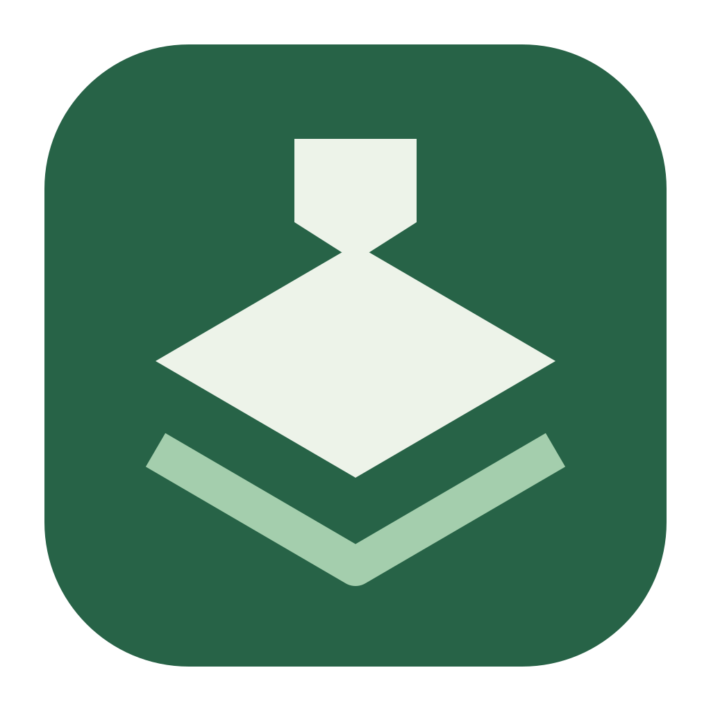
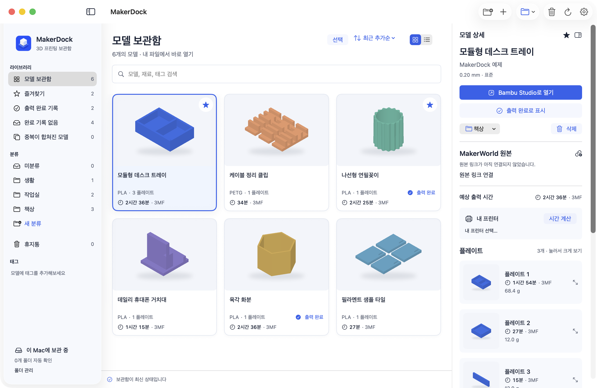
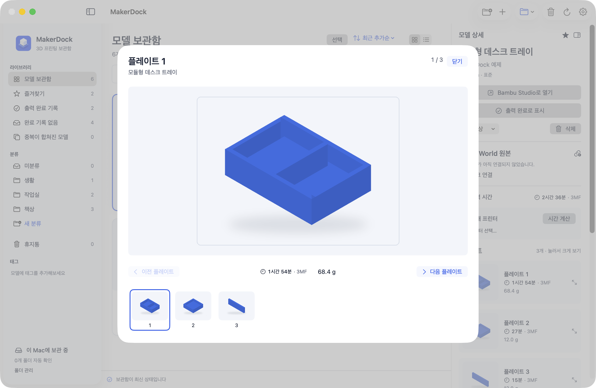
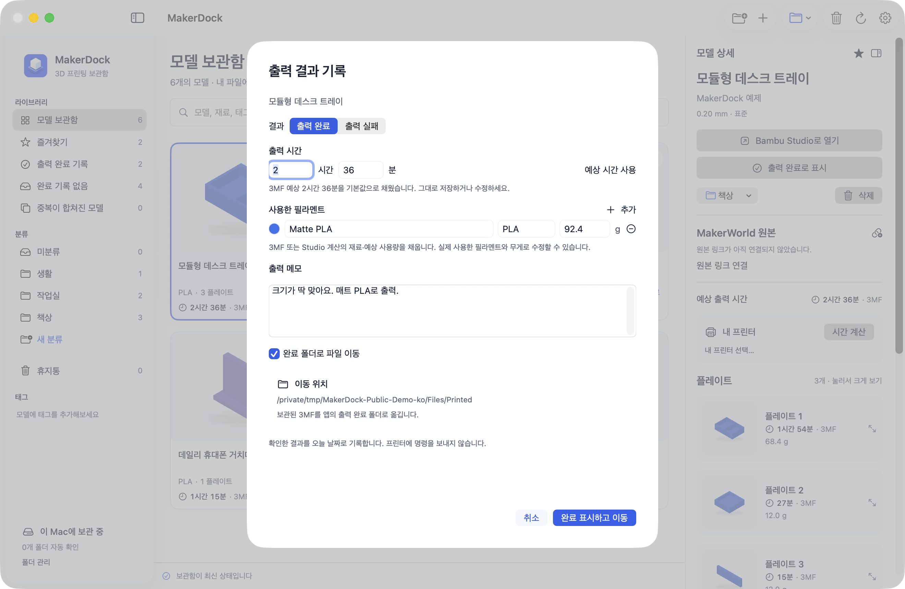
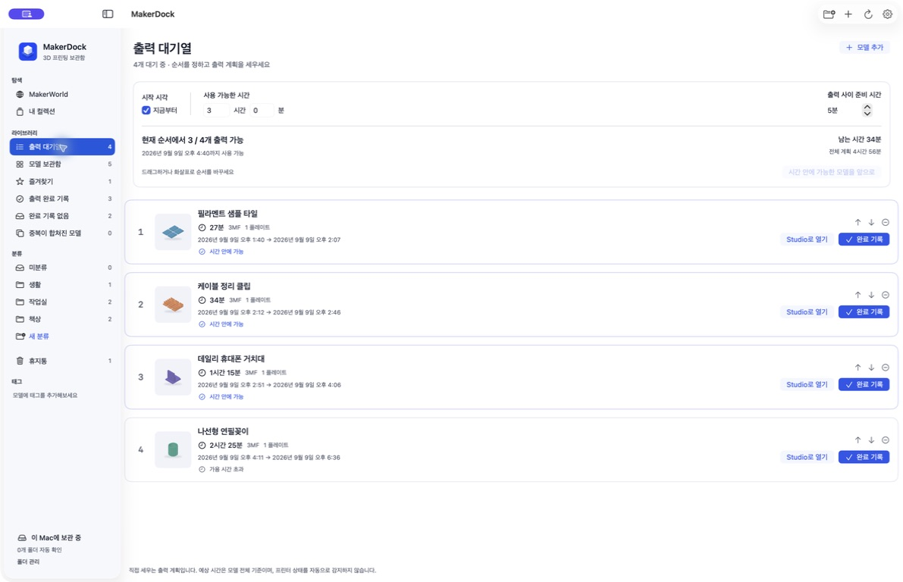
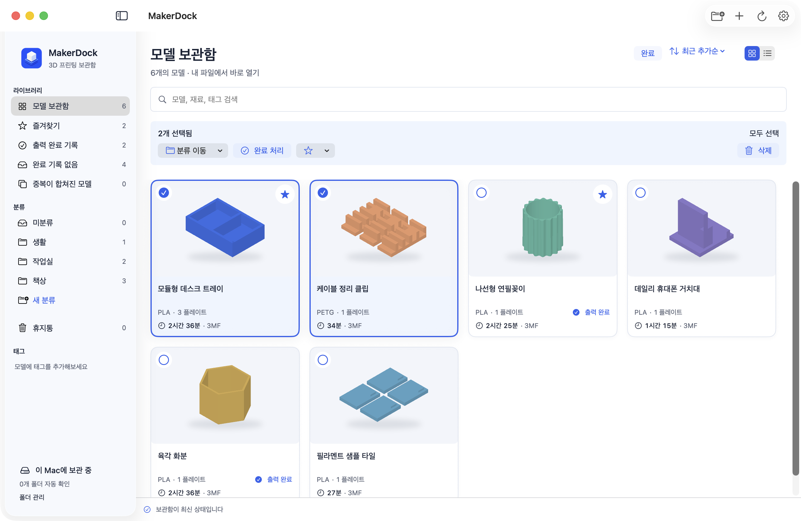

<h1 align="center">MakerDock · 메이커독</h1>

3MF 파일과 출력 기록을 정리하는 macOS 앱 공식 Bambu Studio와 함께 사용합니다.

<a href="README.md">English</a> · 한국어 · <a href="README.zh-CN.md">简体中文</a> · <a href="README.ja.md">日本語</a>

<a href="https://makerdock.goodtail.app/ko">웹사이트</a> · <a href="https://github.com/Goodtail/MakerDock/releases">다운로드</a> · <a href="#만든-이유">만든 이유</a> · <a href="#출시-예정">출시 예정</a> · <a href="Docs/development.md">소스에서 빌드</a>

macOS 13 이상 · Apple Silicon / Intel · 무료 오픈소스 · MIT

## 만든 이유

마음에 드는 모델을 찾아 3MF를 받고 Studio로 엽니다. 며칠 뒤 다시 출력하려는데 어디 저장했는지 기억이 안 나 또 다운로드합니다. 다운로드 폴더에는 파일이 쌓이지만 Finder에서는 어떤 플레이트가 들어 있는지, 출력에 얼마나 걸리는지, 이미 출력한 모델인지 알기 어렵습니다.

MakerDock은 받은 모델을 검색·분류·태그·즐겨찾기로 정리합니다. 내용이 같은 파일은 하나로 모으고 다른 프로필은 따로 보관합니다. 저장한 모델을 공식 Bambu Studio에서 다시 열고 출력이 끝나면 기록을 남겨두세요. Studio에서는 작업 사본을 열어 보관 원본을 보호합니다.

### 플레이트를 한눈에

저장된 플레이트 미리보기를 한꺼번에 확인하세요. 클릭하면 크게 열립니다. 카드에는 3MF에 저장된 예상 시간을 표시하며 기존 MakerWorld 예상 정보가 있으면 우선 보여줍니다. 모델·출력 프로필 원본 링크도 함께 연결해두세요.

### 출력 완료 기록

완료로 표시하고 미리 채워진 시간을 그대로 저장하거나 수정하세요. 필라멘트 종류·색상·사용량과 메모도 함께 남겨두세요. 저장 전에는 대화상자에서 보관 파일의 이동 위치를 확인하세요. 같은 모델을 여러 번 출력해도 기록은 따로 남습니다.

### 다음 출력을 미리 줄 세우기

모델을 **출력 대기열**에 넣고 드래그해 순서를 정하세요. 시작 시각과 사용 가능한 시간, 출력 사이의 준비 시간을 넣으면 어디까지 출력할 수 있는지 보여줍니다. 시간이 맞는 모델을 앞으로 모을 수도 있어요. 저장된 예상 시간을 쓰되, 필요하면 직접 수정할 수 있습니다. 대기열에서 완료 기록을 저장하면 목록에서 빠지고 출력 이력은 남습니다. 보관함에서는 출력 시간이 짧은 순·긴 순으로도 정렬할 수 있어요.

모델 전체의 예상 시간을 바탕으로 직접 세우는 계획입니다. 프린터 상태를 감지하거나 자동으로 출력을 시작하지는 않습니다.

### 여러 모델을 한 번에 정리

격자·목록 보기에서 여러 모델을 골라 한꺼번에 분류하거나 즐겨찾기에 추가하세요. 완료 처리와 휴지통 이동도 같은 방식으로 합니다. 복원하면 메모와 출력 기록도 돌아옵니다. 여러 모델을 완료로 표시해도 시간과 필라멘트 기본값은 모델마다 그대로 남습니다. 필요하면 공통 메모를 덧붙이세요.

보관함은 이 Mac에 저장됩니다. MakerDock 계정은 필요 없으며 이용 분석 정보를 수집하지 않습니다. 한국어·영어·일본어·중국어 간체를 지원하고 화면 테마는 시스템·라이트·다크 중에서 고릅니다.

## 시작하기

1. [Releases](https://github.com/Goodtail/MakerDock/releases)에서 DMG를 받으세요. 서명·공증 상태는 해당 릴리스 설명에 표시합니다.
2. **MakerDock**을 **Applications** 폴더로 옮깁니다. macOS 13 이상, Apple Silicon과 Intel을 지원합니다.
3. `.3mf` 파일을 가져오거나 창에 끌어 놓고 필요하면 자동 확인할 폴더를 고릅니다.
4. 모델을 확인해 별도로 설치한 **공식 Bambu Studio**에서 열고 실제 출력이 끝나면 완료 기록을 남깁니다.

보관함 보기와 수동 기록에는 Studio가 필요하지 않습니다. 슬라이싱과 Studio 기반 시간 계산에는 필요합니다.

## 예상 시간과 실제 출력 기록

아직 슬라이싱하지 않은 3MF에는 예상 시간이 없을 수 있습니다. 설치된 공식 Bambu Studio가 호환되면 MakerDock에서 프린터·노즐·출력 품질을 골라 계산을 요청하세요. Studio에서 현재 선택한 프린터 설정도 가져옵니다. 프린터를 고르는 것만으로 시간이 생기지는 않으며 슬라이싱이 필요합니다.

출력 완료는 **사용자가 직접 기록**합니다. 프린터의 작업 완료를 자동 감지하거나, 실시간 AMS 재고를 읽거나, 실제 소모량을 측정하지는 않습니다. 실제 결과가 다르면 미리 채워진 시간과 필라멘트 값을 수정하세요.

## 출시 예정

**Chrome 보조 확장 프로그램은 출시 예정입니다.** 웹의 모델·프로필 정보를 보관함에 연결하고 이미 받은 파일을 다시 쓰도록 준비하고 있습니다.

MakerDock 안에서 MakerWorld를 둘러보고, 보관한 모델과 출력 프로필의 원본 페이지를 바로 열 수 있습니다. MakerWorld에 로그인하면 **내 컬렉션**으로도 이동할 수 있습니다. 자동 다운로드 감지는 실험 단계이며 공개 DMG에서는 비활성화되어 있습니다. [연동 현황](Docs/integration-status.md)을 참고하세요.

## 개발과 라이선스

SwiftUI·AppKit으로 만들었으며 3MF 압축 파일은 ZIPFoundation으로 읽습니다.

[개발·테스트 안내](Docs/development.md) · [개인정보 안내](PRIVACY.md) · [기여 안내](CONTRIBUTING.md) · [외부 라이선스](THIRD_PARTY_NOTICES.md)

코드·문서·직접 만든 예제는 [MIT 라이선스](LICENSE)로 공개합니다. Bambu Studio는 별도의 AGPL 앱이며 포함하지 않습니다. MakerDock은 Goodtail의 독립 프로젝트로 Bambu Lab·MakerWorld의 공식 앱이나 제휴 앱이 아닙니다. 관련 명칭과 상표는 각 소유자에게 속합니다.

스크린샷은 직접 만든 예제 모델과 설명용 예상값으로 실제 앱을 한국어로 실행해 촬영했습니다. 개인 보관함과 외부 제작자의 다운로드 모델은 포함하지 않았습니다. <a href="Docs/screenshots/README.md">촬영·재현 안내</a>
