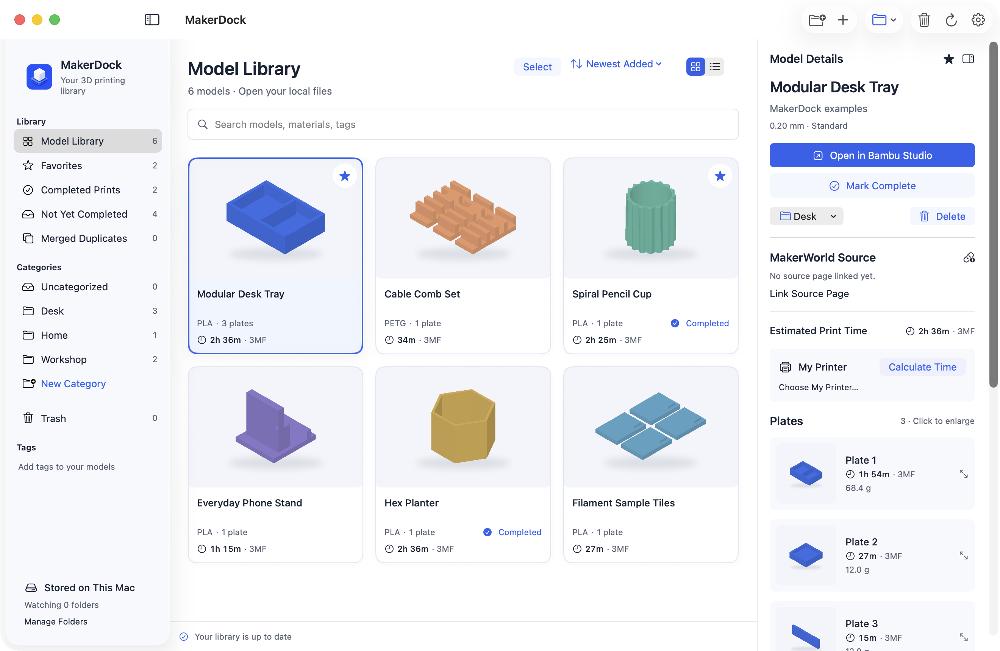
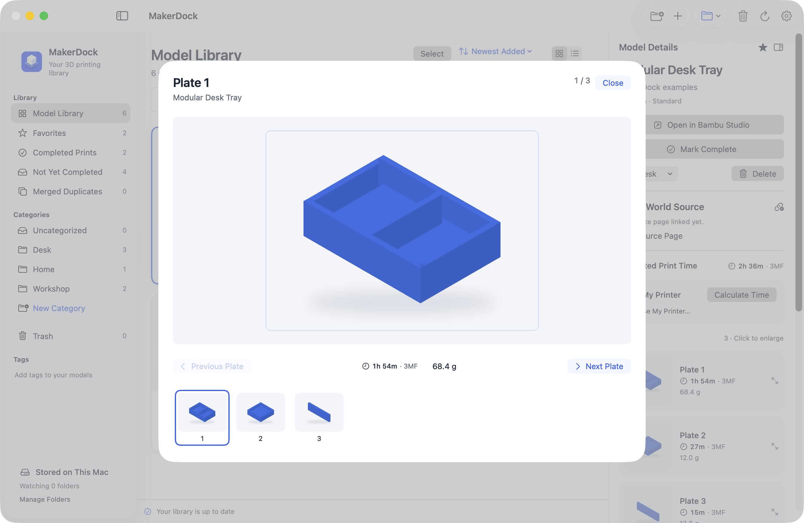
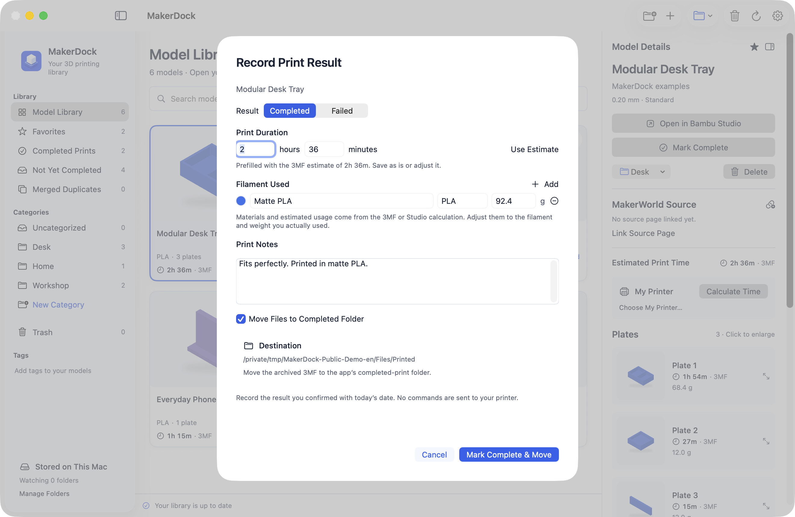
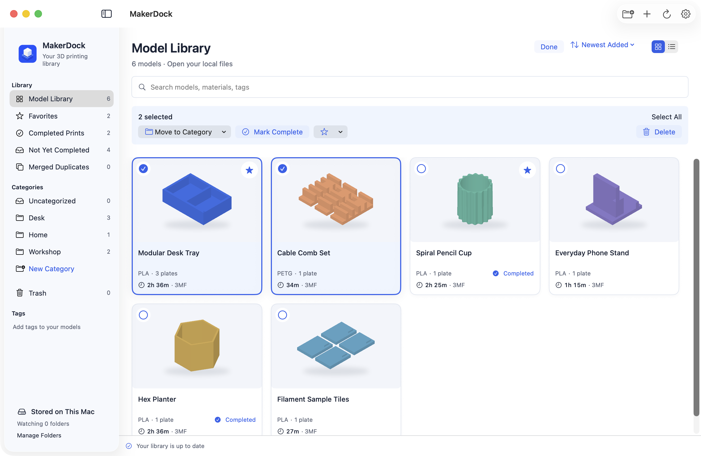

<h1 align="center">MakerDock</h1>

A macOS library for your 3MF files and print history. Works with the official Bambu Studio.

English · <a href="README.ko.md">한국어</a> · <a href="README.zh-CN.md">简体中文</a> · <a href="README.ja.md">日本語</a>

<a href="https://github.com/Goodtail/MakerDock/releases">Downloads</a> · <a href="#why-makerdock">Why MakerDock?</a> · <a href="#coming-next">Roadmap</a> · <a href="Docs/development.md">Build from source</a>

macOS 13+ · Apple Silicon & Intel · Free and open source · MIT

## Why MakerDock?

You find a great model, download its 3MF, and open it in Studio. A week later, you download it again because you cannot remember where you saved it. Your Downloads folder keeps growing. Finder cannot tell you which plate is inside, how long the print might take, or whether you already printed it.

MakerDock keeps those files in a searchable library with categories, tags, and favorites. Identical imports are merged, while different profiles stay separate. Reopen a stored model in the official Bambu Studio, then record the print when it finishes. Studio edits a working copy, preserving the archived original.

### See every plate

Browse all saved plate previews together and click one to enlarge it. Cards show stored 3MF times, with saved MakerWorld estimates taking priority when available. You can attach the original model and profile links too.

### Record completed prints

Mark a model complete and save the prefilled duration, or adjust it. Add filament type, color, grams, and a note. The completion dialog also shows where the archived file will move. Each print has its own record.

### Organize a whole batch

Select several models in grid or list view to categorize, favorite, mark complete, or move to Trash. Restore them with their notes and records intact. Bulk completion keeps each model's own time and filament suggestions; you can add a shared note.

Your library stays on your Mac, with no MakerDock account or analytics. The app supports English, Korean, Japanese, and Simplified Chinese, plus system, light, and dark appearance.

## Get started

1. Get the DMG from [Releases](https://github.com/Goodtail/MakerDock/releases). The release notes state its signing and notarization status.
2. Drag **MakerDock** into **Applications**. Requires macOS 13 or later; the universal app supports Apple Silicon and Intel.
3. Import a `.3mf` file, drag files into the window, or choose a folder to watch.
4. Browse the model, open it in your separately installed **official Bambu Studio**, and record completion when the print is finished.

Bambu Studio is optional for library browsing and manual records. It is required to slice or use Studio-based time calculations.

## What an estimate means

An unsliced 3MF may have no saved time. MakerDock can request a calculation from a compatible installed Bambu Studio using your chosen printer, nozzle, and quality. You can also import the current printer selection from Studio. Slicing is still required; selecting a printer alone does not produce an estimate.

Completion is **recorded by you**. MakerDock does not automatically detect a finished printer job, read live AMS spool inventory, or measure actual filament consumption. Prefilled estimates and filament values should be adjusted if your result differs.

## Coming next

A **Chrome companion extension is coming soon**, to connect model and profile information with files already in your library.

Browse MakerWorld without leaving MakerDock. Open saved model and profile links in the app, or jump to **My Collections** after signing in to MakerWorld. Automatic download capture remains experimental and disabled in the public DMG. See [integration status](Docs/integration-status.md).

## Development and license

Built with SwiftUI and AppKit. ZIPFoundation handles 3MF archives.

See [development and tests](Docs/development.md), [privacy](PRIVACY.md), [contributing](CONTRIBUTING.md), and [third-party notices](THIRD_PARTY_NOTICES.md).

MakerDock code, documentation, and original example assets are available under the [MIT license](LICENSE). Bambu Studio is a separate AGPL-licensed application and is not bundled. MakerDock is an independent project by Goodtail, not affiliated with or endorsed by Bambu Lab or MakerWorld. Their names and trademarks belong to their respective owners.

All screenshots are actual MakerDock captures in the indicated language, using original demonstration models and illustrative estimates. No personal library or downloaded creator assets are included. Screenshot reproduction: <a href="Docs/screenshots/README.md">notes and generator</a>.
