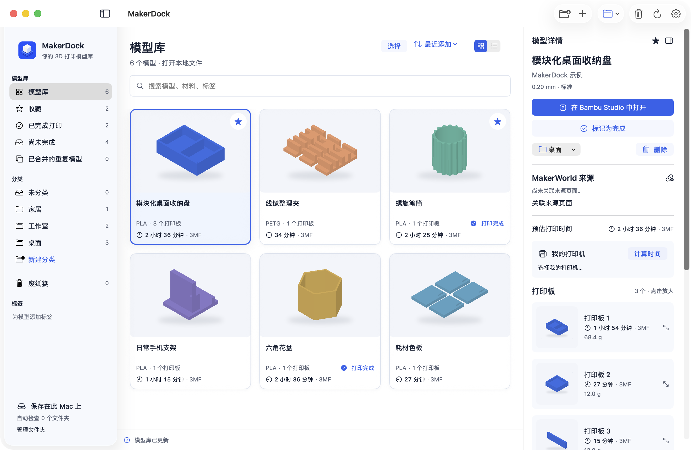
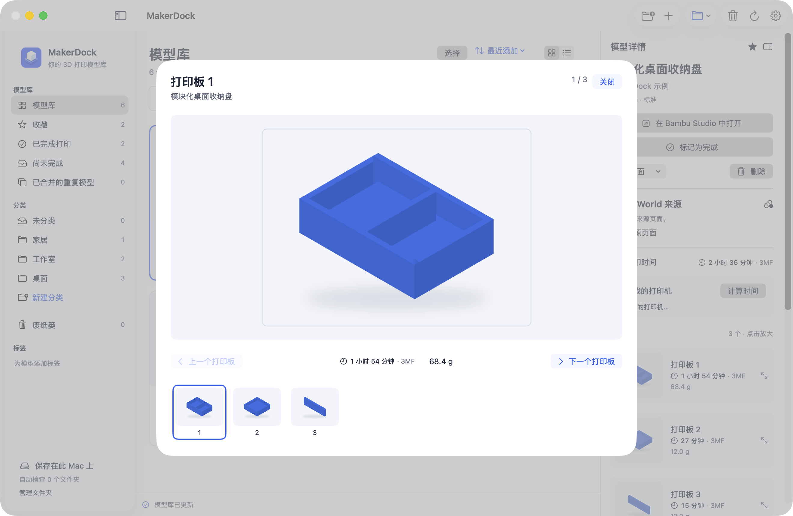
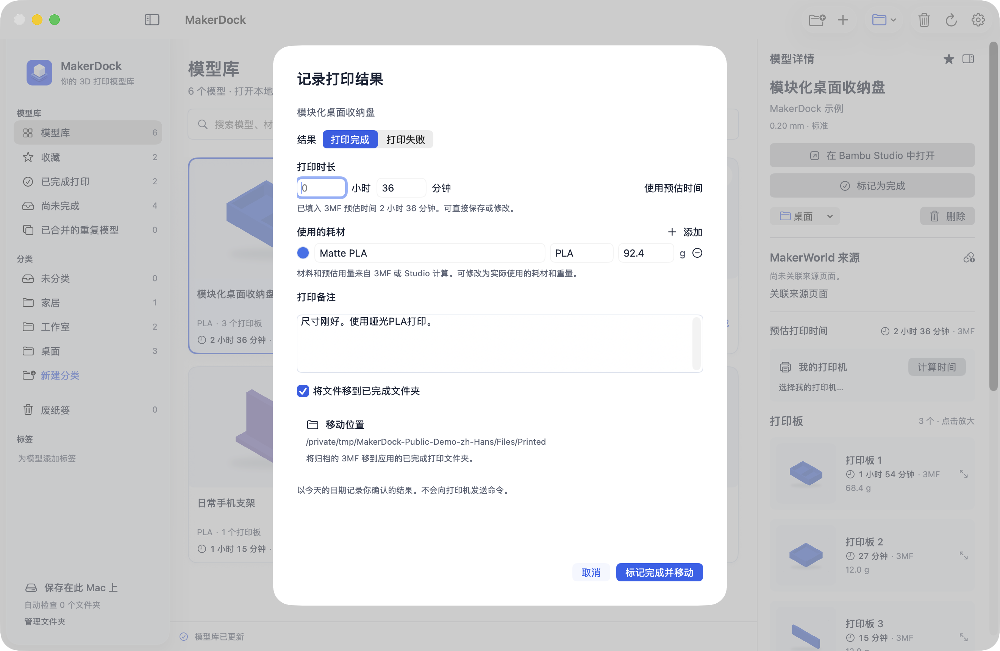
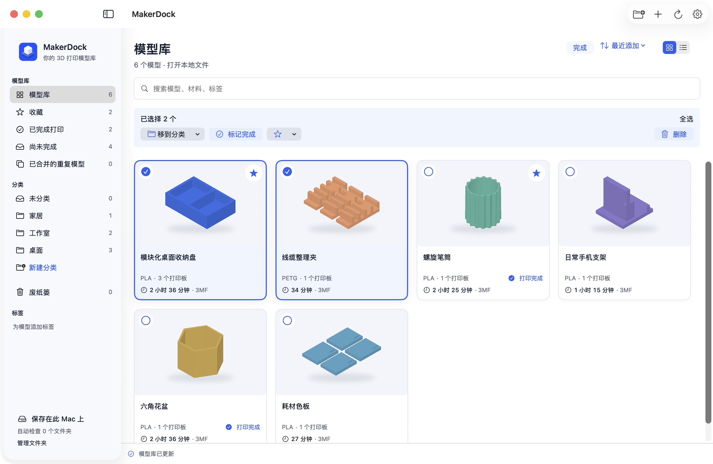

<h1 align="center">MakerDock</h1>

整理3MF文件和打印记录的macOS应用 配合官方Bambu Studio使用。

<a href="README.md">English</a> · <a href="README.ko.md">한국어</a> · 简体中文 · <a href="README.ja.md">日本語</a>

<a href="https://github.com/Goodtail/MakerDock/releases">下载</a> · <a href="#为什么做-makerdock">开发缘由</a> · <a href="#即将推出">后续计划</a> · <a href="Docs/development.md">从源码构建</a>

macOS 13及以上 · Apple Silicon / Intel · 免费开源 · MIT

## 为什么做 MakerDock？

找到喜欢的模型，下载3MF，在Studio里打开。过了几天想再打印，却想不起文件放在哪里，于是又下载一份。下载文件夹越来越满，但Finder无法告诉你每块打印板上有什么、预计要打多久，更不知道这个模型是否已经打印过。

MakerDock把这些文件放进可搜索的模型库，支持分类、标签和收藏。内容相同的文件会合并，不同配置则分别保留。直接用官方Bambu Studio打开已保存的模型，打完后留下记录。Studio打开的是工作副本，模型库中的原件不会被覆盖。

### 一眼查看所有打印板

所有已保存的打印板预览会一起显示，点击即可放大。卡片上显示3MF中的预计时间；如果已有MakerWorld估时，会优先显示。也可以关联模型页和打印配置页的原始链接。

### 记录完成的打印

标记完成时，可以直接保存预填的时间，也可以改成实际时长。耗材类型、颜色、克数和备注都能一起记录。保存前，对话框会显示归档文件将移到哪里。同一个模型打印多次，也会分别留下记录。

### 一次整理多个模型

在网格或列表中多选模型，批量分类、收藏、标记完成或移入废纸篓。恢复时，备注和打印记录也会恢复。批量完成仍保留每个模型各自的时间和耗材预填值，还可以添加共用备注。

模型库保存在Mac上，无需MakerDock账号，也不收集使用分析数据。界面支持英语、韩语、日语和简体中文；外观可跟随系统，或选择浅色、深色。

## 开始使用

1. 在[Releases](https://github.com/Goodtail/MakerDock/releases)下载DMG。签名与公证状态会在对应发行说明中列明。
2. 将**MakerDock**拖入**Applications**文件夹。支持macOS 13及以上、Apple Silicon与Intel。
3. 导入`.3mf`文件，拖入应用窗口，或选择要自动检查的文件夹。
4. 查看模型，用另行安装的**官方Bambu Studio**打开。实际打印完成后，在MakerDock留下完成记录。

浏览模型库和手动记录不需要Studio。切片及基于Studio的时间计算需要安装Studio。

## 估时与实际打印结果

未切片的3MF可能没有预计时间。MakerDock可以调用兼容的官方Bambu Studio，按所选打印机、喷嘴和质量计算。也可以导入Studio当前选择的打印机设置。选择打印机本身不会产生估时，仍然需要切片。

打印完成由**用户手动记录**。MakerDock不会自动检测打印机任务结束，不读取实时AMS料盘库存，也不测量实际耗材消耗。如果实际结果不同，请修改预填的时间和耗材数值。

## 即将推出

**Chrome辅助扩展即将推出。** 计划将网页上的模型和打印配置信息传给模型库，并复用已经保存的文件。

现在可以在MakerDock内浏览MakerWorld，打开已保存模型和打印配置的原始页面。登录MakerWorld后，还可以直接进入**我的收藏集**。自动下载检测仍处于实验阶段，公开DMG中暂未启用。详情见[集成状态](Docs/integration-status.md)。

## 开发与许可

应用使用SwiftUI和AppKit开发，通过ZIPFoundation读取3MF压缩文件。

[开发与测试](Docs/development.md) · [隐私说明](PRIVACY.md) · [参与贡献](CONTRIBUTING.md) · [第三方声明](THIRD_PARTY_NOTICES.md)

代码、文档及原创示例采用[MIT许可](LICENSE)。Bambu Studio是独立的AGPL应用，不包含在本项目中。MakerDock是Goodtail的独立项目，与Bambu Lab或MakerWorld不存在官方隶属、合作或背书关系。相关名称和商标归各自权利人所有。

所有截图均来自实际运行的简体中文应用，使用原创演示模型和示意估时。未包含个人模型库或其他创作者的下载模型。<a href="Docs/screenshots/README.md">截图与复现说明</a>
